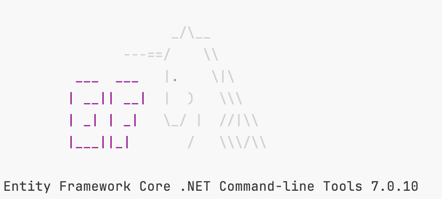
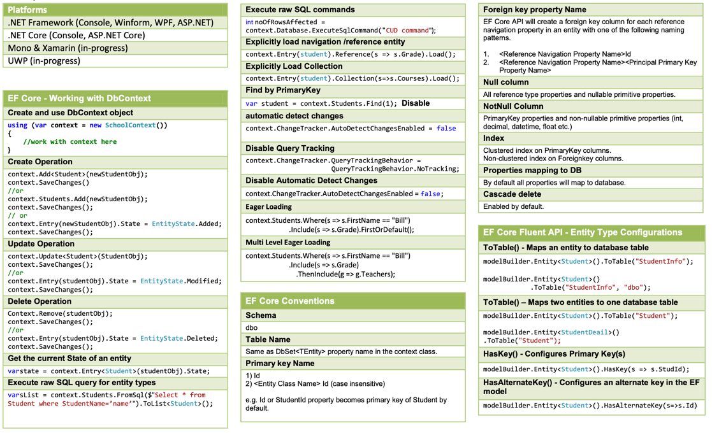
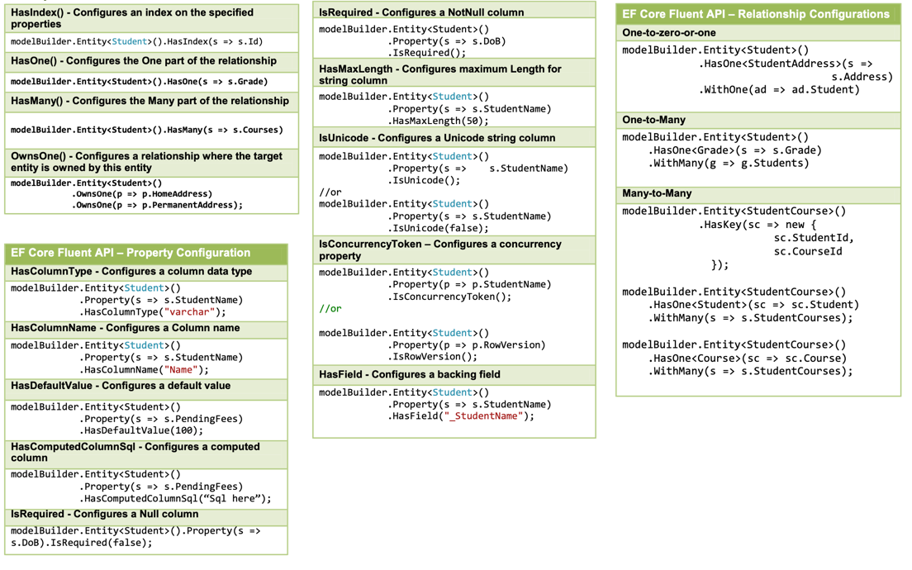

# EF Core cheat sheet

## Install EF Tools globally
```sh
dotnet tool install --global dotnet-ef
or
dotnet tool update --global dotnet-ef (add --version 8.0.0-preview... to install a prerelease)
```
Verify that the installation was successful by running

```dotnet ef --v```

This command should display the version of the EF Core CLI that you installed.


## Entity Framework Core packages

- Microsoft.EntityFrameworkCore
- Microsoft.EntityFrameworkCore.Tools
- Microsoft.EntityFrameworkCore.SqlServer

or [Choose your DB provider...](https://docs.microsoft.com/en-us/ef/core/providers/)

not required nugets:
- Microsoft.EntityFrameworkCore.Design (Design-time support for Entity Framework Core, required for Visual Studio)
- Microsoft.EntityFrameworkCore.InMemory (not required, In-memory database provider for testing and development)

## Create your model classes
```
public class User
{
    public int Id { get; set; }
    public string Name { get; set; } = string.Empty;
    public string Email { get; set; } = string.Empty;
    public string? Hobby { get; set; }
}
```

## Create a DbContext class
```
public class AppDbContext : DbContext
{
    public AppDbContext(DbContextOptions<AppDbContext> options) : base(options)
    {
    }

    public DbSet<User> Users { get; set; }
}
```

## Connection String in appsettings.json
```
{
"ConnectionStrings": {
    "DefaultConnection": "Server=localhost;Database=<DataBase Name>;User Id=<db user name>;Password=<db password>;TrustServerCertificate=true;"
    }
}
```

### add DI and read connection string in Program.cs
```
builder.Services.AddDbContext<AppDbContext>(options => options.UseSqlServer(builder.Configuration.GetConnectionString("DefaultConnection")));
```

## Manage DB Schema

- Add Migration: ```dotnet ef migrations add <MigrationName>```
- Update target database: ```dotnet ef database update```

if you added a new model or changed something, you need to add a new migration and update the database

[Migrations Overview](https://learn.microsoft.com/en-us/ef/core/managing-schemas/migrations/?tabs=dotnet-core-cli)

[Full EF Documentation](https://learn.microsoft.com/en-us/ef/core/)

## Using EF Core in Your Controller

```
public class UserApiController : ControllerBase
{
    private readonly AppDbContext _context;

    public UserApiController(ApplicationDbContext context)
    {
        _context = context;
    }

    // Implement your CRUD actions here.
}
```

## CheatSheet 


